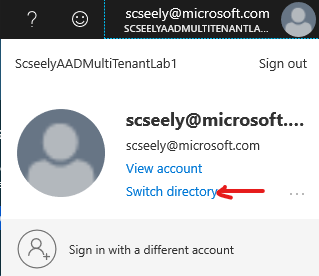
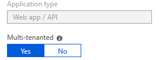

# A Lab for Understanding Multi-tenant Azure Active Directory Support

Applications use Azure Active Directory (AAD) for authenticating users. Some applications need to authenticate users from more than one AAD. Two common use cases are:

1. The organization has employees in two or more AADs due to acquisitions, differences in departmental procurement, or because of historical reasons.
2. The organization has built Software as a Service (SaaS) and needs to integrate with customer AAD to support single sign-on (SSO).

In this lab, you will build an application that supports single sign on from any AAD instance. We will then show how to limit authorization to the AAD instances that your application trusts. Visual Studio can build this capability into an application from the start. However, most of us will be starting with a web application which needs AAD authentication and authorization incorporated. This lab starts with a simple application, then adds AAD authentication and authorization.

To execute this lab, you need the following items already installed:

1. [Visual Studio Code](https://code.visualstudio.com/)
2. Git tools ([https://git-scm.com/](https://git-scm.com/)).
3. [PowerShell](https://docs.microsoft.com/en-us/powershell/scripting/setup/installing-powershell)
4. [Azure RM PowerShell](https://docs.microsoft.com/en-us/powershell/azure/install-azurerm-ps)

    If you've already installed this, run Update-Module -Name AzureRM from an admin PowerShell CLI.

1. AzureAD Powershell (run Install-Module -Name AzureAD if not installed).
2. .NET Core SDK (so you can build apps)

The lab should work well on Windows, Linux, or Mac. The lab assumes that the Azure CLI, the Git tools, and the .NET Core SDK are already accessible via your command line path.

Many of the exercises in this lab can be executed from a GUI or web page. Because many of these tasks may need to be automated and run from scripts, we have chosen to show how to do the work from the command line.

# Lab 1: Clone the project from github.com

In this lab, we will clone a git repository. Open a command line interface and navigate to the directory where you want to run the lab. Enter the following git command:

```
git clone [https://github.com/scseely/AADLab.git](https://github.com/scseely/AADLab.git)
```

If you have a github.com account, feel free to fork the repository so that you can commit changes as you move along.

# Lab 2: Create Active Directories

In this step, we will create two AAD instances. One will be associated with our application; this one houses the application AAD configuration and mimics what we would do for a SaaS application. The other AAD will be used to hold an identity to verify that we can accept logins from multiple AAD instances.

First, make sure you are logged in. Run the following command:

```
Connect-AzAccount
```

Upon logging in, you can see a list of the subscriptions you have access to. List those subscriptions using the following:

```
Get-AzSubscription
```

From the list displayed, select the default subscription for your commands:

```
Set-AzContext -SubscriptionId <subscription GUID>
```

Verify that the right account is set by executing

```
Get-AzContext
```

Once logged in, you create two active directories with globally unique names. These names cannot be more than 27 characters long. Suggested names are:

- < your email alias >AADLab1
- < your email alias >AADLab2

In the lab, we refer to these as the names

-  <i>UniquePart</i>AADLab1
-  <i>UniquePart</i>AADLab2

This is one of the tasks you need to do from the portal. To create an Azure Active Directory, follow these steps:

1. Open your web browser and navigate to [https://portal.azure.com/#create/hub](https://portal.azure.com/#create/hub).
2. In the search box, enter _Azure Active Directory_
3. Click on _Create_
4. For _Organization name_ and _Initial domain name_, enter <i>UniquePart</i>AADLab1
5. Click on _Create_
6. Repeat steps 1-5, using <i>UniquePart</i>AADLab2 for the other Azure Active Directory. You can do this while Azure provisions the first AAD.

The operations should complete in about one minute. At this time, you should be able to see both AAD instances from the portal. If you click on your name in the upper right hand corner of the portal, you will see an option to _Switch Directory_. Click on that.

 

You will then see a list, and the list should show both directories. Note the GUIDs associated with the new directories. I have these:

 

- ScseelyAADLab1: e0b57188-0de8-460b-8aef-73bf95a55d82
- ScseelyAADLab2: ca7ce8fe-9914-4a7c-83cc-5c7317170fb4

Copy those values to OneNote, notepad, or anywhere else you can easily copy+paste them.

# Lab 3: Create an application in <i>UniquePart</i>AADLab1

We will be setting up an application on your local machine to work with AAD. Before we do this, we need to set the <i>UniquePart</i>AADLab1 as the current AAD we are working with.

1. Login. Use the following to select <i>UniquePart</i>AADLab1, using the GUID you recorded at the end of Lab 2:

    ```
    Connect-AzAccount -TenantId "<<i>UniquePart</i>AADLab1>
    ```

    For example, I entered:

    ```
    Connect-AzAccount -TenantId "e0b57188-0de8-460b-8aef-73bf95a55d82"
    ```

    This then shows information about you in that tenant. At any time, you can see which tenant is in context with the command:

    ```
    Get-AzureADTenant
    ```

    #
    # TODO: The display from this command is different than what I see now.
    #

    I get the following output:

    ```
    ObjectId                             DisplayName               VerifiedDomain

    --------                             -----------               --------------

    e0b57188-0de8-460b-8aef-73bf95a55d82 ScseelyAADLab1 ScseelyAADLab1.onmicrosoft.com
    ```

1. Create the AAD application entry. This isn't an actual application; instead it is just the data about an application that will eventuagilly exist. Now that we have the tenant selected, we need to create the application registration within the AAD tenant. We want the application to allow for multiple tenants. Most of the parameters are boilerplate; we set the AvailableToOtherTenants parameter to $True so that AAD knows this application will process logins from multiple AAD tenants. Enter the following command to register the application with the AAD tenant, remembering to replace the IdentifierUri <i>UniquePart</i> with the string you used for directory uniqueness:

    #
    # TODO: New-AzureADApplication is now Get-AzADApplication. This hangs my Mac which makes me thing the dependency the PowerShell commandlet takes is making me fail because it's full .NET
    #

    ```
    New-AzureADApplication -DisplayName 'AADLab' -ReplyUrls "https://localhost:5001/signin-oidc" -Homepage 'https://localhost:5001' -AvailableToOtherTenants $True -IdentifierUris "http://AADLab.PartAADLab1.onmicrosoft.com"
    ```

    The output will look something like this:

    ```
    ObjectId                             AppId                                DisplayName

    --------                             -----                                -----------

    eebcc0a6-d3fe-40c2-bf9e-aca338653f72 740c89e3-e856-45a7-9fe0-8f6f37427e61 AADLab
    ```

    If you ever need to list the applications in the tenant, use the Get-AzureADApplication command.

    At this point, we have created our application. You should be able to see it in the Active Directory within the portal. If the application does not show up, make sure that you've switched the directory to <i>UniquePart</i>AADLab1. From the portal, you can view the applications by doing the following:

    <ol type="a">
        <li> Select _Azure Active Directory_. </li>
        <li> Click on _App Registrations_.</li>
        <li> If no applications appear, click on <i>View all applications</i>.</li>
    </ol>
1. Add a service principal. This is the identity the application uses with respect to AAD. Using the AppId you had from creating the application in place of <AppId> below, run the following command (all one line):

    ```
    New-AzureADServicePrincipal -AccountEnabled $True -AppId "<AppId>" -AppRoleAssignmentRequired $True -DisplayName "AADLab"
    ```
1. Add permission to read the AAD graph, which is required to allow the actual application to read data about users. We do this with the following PowerShell. Note that we use the ObjectId this time instead of the AppId. [Note, line ii is split across two lines here, though must be entered as one command.]

```
$req = New-Object -TypeName "Microsoft.Open.AzureAD.Model.RequiredResourceAccess"

$req.ResourceAccess = New-Object -TypeName "Microsoft.Open.AzureAD.Model.ResourceAccess" -ArgumentList "311a71cc-e848-46a1-bdf8-97ff7156d8e6","Scope"

$req.ResourceAppId = "00000002-0000-0000-c000-000000000000"

Set-AzureADApplication -ObjectId <ObjectId> -RequiredResourceAccess $req
```

Click around on the application and observe what was created so far. Look at _Settings_-->_Properties_ and scroll to the bottom of the properties blade. If you did everything correctly, _Multi-tenanted_ should be set to _Yes_.

 

# Lab 4: Update your .NET application to support Azure AD

In this section, we will do the following tasks:

1. Install AAD assemblies
2. Update configuration to provide the necessary information to AAD.
3. Add code to startup to use AAD authentication

## Step 1: Install AAD Assemblies

In the VS Code, open the Lab4 directory as your project. From VS Code, edit the AADLab.csproj file and add the following line to the other < PackageReference > elements:

```
<PackageReference Include="Microsoft.AspNetCore.Authentication.AzureAD.UI" Version="2.\*"/>
```

Then, save the file. The line tells VS Code to lookup the latest 2.x version of the package and add the Microsoft.AspNetCore.Authentication.AzureAD.UI package and any dependencies. Upon saving the file, VS Code will put up a message in the lower right hand corner of the window stating "There are unresolved dependencies'. Please execute the restore command to continue."

Press the _Restore_ button.

After a little time, the assemblies should be installed. We are now ready to setup our configuration.

## Step 2: Update configuration

Open up appsettings.json. Within the file, we need to add a bit of JSON to configure AAD. We need to set the following things:

1. The location to login. We will set this to reference https://login.microsoftonline.com/common, the endpoint which allows for authentication from all AAD instances.
2. The client ID. This helps AAD identify which application is being authenticated. This then informs AAD about things like which claims to provide, if the app itself support multiple tenants, and so on.
3. The callback path: the URL on the website which will handle the response.

All of the above is mediated through the client browser, which is why our localhost deployment of the web app will work.

Copy the following JSON into appsettings.json:

```
  "AzureAd": {

    "Instance": "https://login.microsoftonline.com/",

    "TenantId":  "common",

    "ClientId": "<app id>",

    "CallbackPath": "/signin-oidc"

  },
```

To get the client ID, run the following command:

```
Get-AzureADApplication
```

If your app does not appear, make sure you have the right AAD instance active. Labs 2 and 3 have instructions on how to do this. Take the application ID and enter that in place of <app id> in the pasted JSON.

We have configuration completed, now, we can add code and tie this all together.

## Step 3: Add code

In this step, we will add authentication and will authorize anyone with an AAD identity to use the application, even someone outside of our AAD tenants. The last lab will work through authorizing only those we trust. We will first add a partial view to Pages\Shared named \_LoginPartial.cshtml. This partial view handles showing the logged in user. To do this:

1. In the explorer view under Pages\Shared, right-click and select _New File_. Name the file \_LoginPartial.cshtml.
2. Edit the file, adding the following:

    ```
    @if (User.Identity.IsAuthenticated)
    {
        <ul class="nav navbar-nav navbar-right">
            <li class="navbar-text">Hello @User.Identity.Name!</li>
            <li><a asp-area="AzureAD" asp-controller="Account" asp-action="SignOut">Sign out</a></li>
        </ul>
    }
    else
    {
        <ul class="nav navbar-nav navbar-right">
            <li><a asp-area="AzureAD" asp-controller="Account" asp-action="SignIn">Sign in</a></li>
        </ul>
    }
    ```

    If the user is logged in, say 'Hi' and give them the ability to log out. If they aren't logged in, given them a place to sign in.

1. Open \_Layout.cshtml. After the < ul > which describes the menu, add the highlighted line (near line 37):

    ```
    <div class="navbar-collapse collapse">
        <ul class="nav navbar-nav">
            <li><a asp-page="/Index">Home</a></li>
            <li><a asp-page="/About">About</a></li>
            <li><a asp-page="/Contact">Contact</a></li>
        </ul>
        <partial name="\_LoginPartial" />
    </div>
    ```

    This will get the login piece to display on all pages.

1. Open Startup.cs. Within ConfigureServices, we add code immediately before the line which reads

    ```
    services.AddMvc().SetCompatibilityVersion(CompatibilityVersion.Version\_2\_1);
    ```

    We add the following lines to add AAD authentication and to allow all AAD tenants to work:

    ```
                services.AddAuthentication(AzureADDefaults.AuthenticationScheme)
                    .AddAzureAD(options => Configuration.Bind("AzureAd", options));
                services.Configure<OpenIdConnectOptions>(AzureADDefaults.OpenIdScheme, options =>
                {
                    options.TokenValidationParameters = new TokenValidationParameters
                    {
                        ValidateIssuer = false,
                    };
                    options.Events = new OpenIdConnectEvents
                    {
                        OnTicketReceived = context =>
                        {
                            return Task.CompletedTask;
                        },
                        OnAuthenticationFailed = context =>
                        {
                            context.Response.Redirect("/Error");
                            context.HandleResponse(); // Suppress the exception
                            return Task.CompletedTask;
                        },
                    };
                });
    ```
1. Within the Configure method, enable authentication, and the /signin-oidc page which was configured in Step 2, by adding the following line just before UseMvc()

    ```
    app.UseAuthentication();
    ```

1. Finally, we add a few using statements to the top of Startup.cs so that the new code can compile.

    ```
    using Microsoft.AspNetCore.Authentication;
    using Microsoft.AspNetCore.Authentication.AzureAD.UI;
    using Microsoft.AspNetCore.Authentication.OpenIdConnect;
    using Microsoft.IdentityModel.Tokens;
    ```

1. Now, run the website. If all goes well, you should be able to login using the same credentials you use when logging into the portal. You may see that you are need an administrators permission to make this application available to your company. If you see that, you didn't fail; your administrators have locked things down well. We will address the issue in the next lab.

# Lab 5: Login from a different tenant

To do this, we will create a user in the tenant <i>UniquePart</i>AADLab2. Once created, we will use that identity to log in.

1. Open PowerShell.
2. Connect to the other tenant using:

    ```
    Connect-AzureAD -TenantId "<GUID for <i>UniquePart</i>AADLab2>"
    ```

1. Run the following block of commands:

    - $domain = (Get-AzureADTenantDetail).VerifiedDomains[0].Name
    - $username = 'labuser'
    - $pwdProfile = New-Object -TypeName Microsoft.Open.AzureAD.Model.PasswordProfile
    - $pwdProfile.Password = 'P@ssword123'
    - New-AzureADUser -AccountEnabled $True -DisplayName 'Lab User' -UserPrincipalName "$username@$domain" -PasswordProfile $pwdProfile -MailNickName $username

    As a result of running the commands, you will see an object gets created with the name and email address selected above.

With this ready, we should be able to run the application. Your user name will be labuser@<i>UniquePart</i>AADLab2.onmicrosoft.com. You can copy this name from the output of step 3 if you want to avoid typos. We now need to login.

1. From VS Code, with the lab open, select _Debug__Start Debugging_.
2. On the web page, click on _Sign In_
    
    

    If you run into a page that says you can't run this application, you need to log out of AAD. You can do this from a number of places; the following steps show how to do this from the Azure Portal.

    <ol type="a">
    <li>Login to <a href="https://portal.azure.com">https://portal.azure.com</a>.</li>
    <li>Click on your name on the upper right.</li>

    

    <li>Select <i>Sign out</i></li>

    
    <li>Ignore the offer to login to a new account. Instead, navigate to <a href="https://locahost:5001/">https://locahost:5001/</a> or restart the application in VS Code.</li>
    <li>Click on <i>Sign in</i></li>
    </ol>
2. Since we've never logged in as the labuser identity, we'll select _Use another account_ from the Account Picker.

    

    Use the labuser@PartAADLab2.onmicrosoft.com email with the password P@ssword123. You will be asked to change the password on first usage. Use whatever you like. Upon logging in, you'll see the following:

    

    Click on Accept. You have now successfully logged into a multi-tenant application. As evidence, you see the user name displayed in the title bar.

    


